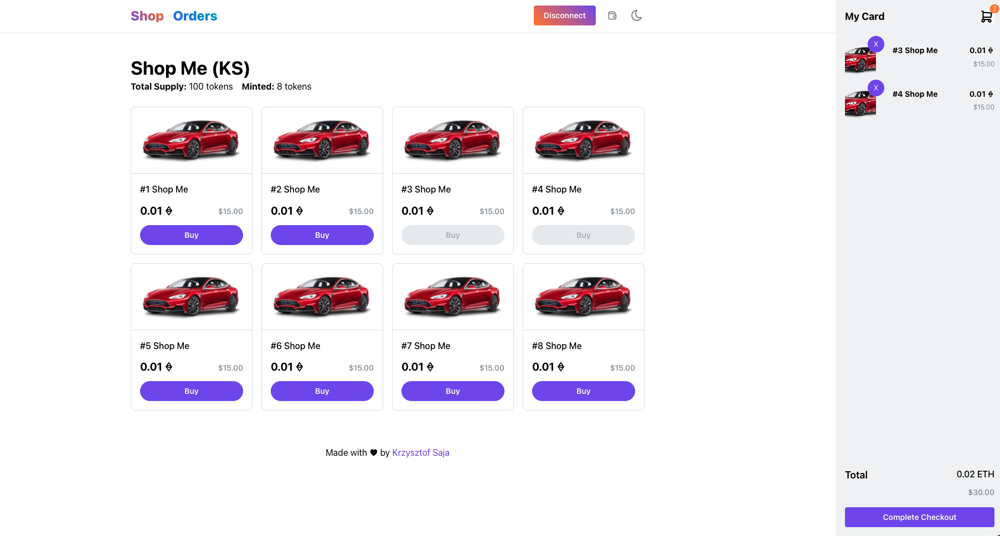

# NFT SHOP Example POC

This is a POC project for NFT Shopp application (dApp) development.

#### Important links
* [Published APP - NFT Shop on Vercel](https://nft-shop-krzysztofsaja.vercel.app)
* [Published Shop ME (KS) ERC721 contract](https://goerli.etherscan.io/address/0x5b59819a22e5fa7ee482a49069773aaf8d3c69e2)
* [Fake Safe Vault Address with transferred tokens](https://goerli.etherscan.io/address/0x1e4EeD1E29B284baCF87D7c75C5798280CB40BA7#tokentxnsErc721)
* [Github Code Repository](https://github.com/krzysztofsaja/nft-shop)

## Tech Stack
### Frontend

* Next.JS, React, Mantine components, hooks
* Mantine / joi.js form validation
* Wagmi React Hooks for Ether.JS

### Backend
* Next.JS API Rest Endpoints
* FireBase DB to store orders information

### Blockchain
* Hardhat
* Goerli ETH blockchain contract ERC721 with some custom functions (unsafe)
* Tests for main contract functionalities

## Required features

App was developed based on the following requirements + bonuses:

* User can browse minted tokens in a grid
* User can open/close the cart
* User can add a token to the cart on click of the product. Cart should open each time a token is added and the token should be listed in the cart
* User can remove a token from the cart
* User can see the total of the cart
* User can checkout on click of the checkout button. Display a confirmation alert
* Transactions will be triggered on click of check out, token and goerlieth sent to the wallet “0x1e4EeD1E29B284baCF87D7c75C5798280CB40BA7”.
* User can see its balance of goerlieth (wallet icon on navbar)
* Contract for token is deployed on Goerli
* Contract token should implement the ERC-721 standard
* On checkout, transaction is triggered, tokens and payment are transferred to 0x1e4EeD1E29B284baCF87D7c75C5798280CB40BA7
* For each token, retrieve its name, its contract address and a fake price of your choice in Eth (rounded to two decimals)
* UI is based on Figma requirements (not color / pixel perfect)
* UI is responsive and work well with mobile and desktop
* App is deployed into Vercel
* Deploy a contract that manages order on chain and actually create real listings and order
* Use the mantine form utils to validate the data
* Show network information with current ETH balance (click on wallet button)
* Make a next js api endpoint that receive the checkout form data, validate it another time, and save it to Firestore - if the api return 200 success show a success notification in the front

**Additional features** not mentioned in requirements were also implemented

* UI Order page with table of stored orders in FireStore
* Theme switcher (Light / Dark mode)
* Store Shopping App State in localstore via Mantine hooks
* Notifications for different actions
* Get Orders Rest Endpoint
* Custom Network Switcher
* Additional shopping logic like disabling "Buy" buttons for added element to Cart
* App supports Hardhat / Localhost blockchain

## To Do

Things that should be implemented but was outside the requirements and time limits

* add more tests
* NFT image is hardcoded on the frontend - fetch proper NFT image with skeleton loader
* NFT price is hardcoded on the frontend - add price to Contract and create proper calculations / requirements

# Resources

Things that may be helpful:

- [Web3Modal demo](https://codesandbox.io/s/web3modal-demo-j43b10?file=/src/networks.js:0-695)
- [MantineUI + NextJS](https://mantine.dev/theming/next/)
- [Mantine Notifications](https://mantine.dev/others/notifications/)
- [Mantine Themes](https://mantine.dev/theming/mantine-provider/)
- [MetaMask & Hardhat](https://www.web3.university/article/how-to-build-a-react-dapp-with-hardhat-and-metamask)
